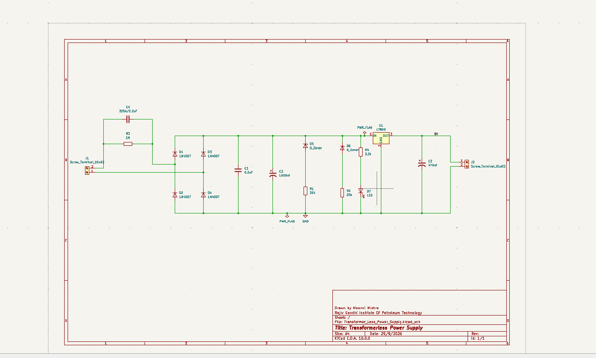
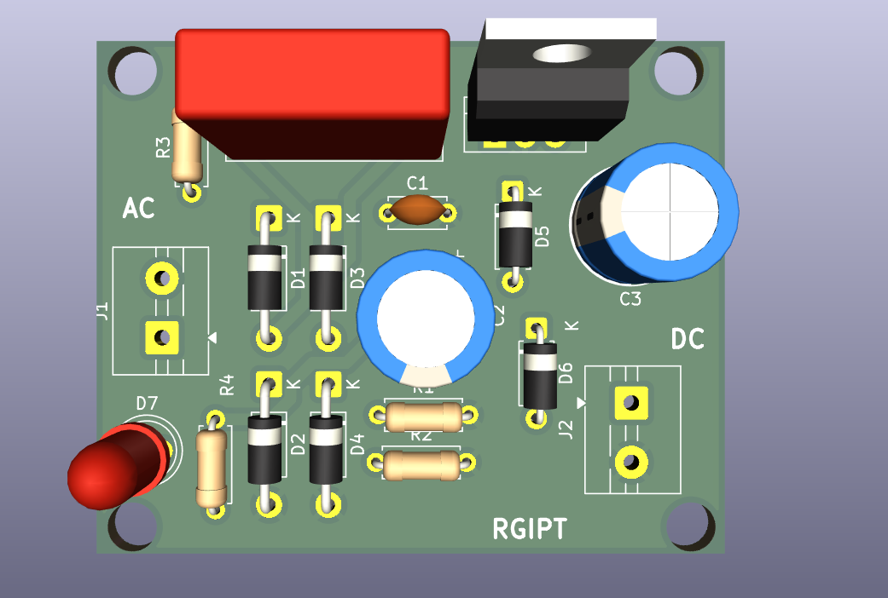

# Transformer-Less Power Supply

A transformer-less power supply designed and developed using **KiCad**, including circuit schematic design and PCB layout.

## 📌 Project Overview

This project involves the design of a transformer-less power supply with the complete circuit schematic and PCB layout developed using KiCad.

The project covers the complete PCB design workflow, from schematic capture and component selection to PCB layout and routing.

## 🛠️ Tools Used

- KiCad
- KiCad Schematic Editor
- KiCad PCB Editor

## 🔧 Design Workflow

1. Circuit schematic design
2. Component selection
3. Footprint assignment
4. PCB layout
5. Component placement
6. PCB routing
7. Design Rule Check (DRC)
8. Final PCB design review

## 📁 Project Files

| File | Description |
|------|-------------|
| `.kicad_sch` | Circuit schematic |
| `.kicad_pcb` | PCB layout |
| `.kicad_pro` | KiCad project configuration |

## 📐 Design

### Schematic

### Schematic

The complete circuit schematic was designed using KiCad.

### PCB Layout

### PCB Layout

The PCB layout was designed and routed using KiCad.

### 3D PCB View

### 3D PCB View

## ⚠️ Safety Warning

This project involves a **transformer-less power supply design**, which may involve hazardous mains voltage depending on the implementation.

The circuit should be treated as potentially non-isolated from the AC mains. Appropriate electrical safety precautions, isolation, protection, enclosure, and adequate PCB creepage and clearance must be considered during testing and operation.

This project is intended primarily for educational and engineering design purposes.

## 👩‍💻 Author

**Maanvi Mishra**

Electronics Engineering | Embedded Systems | PCB Design

GitHub: [Maanvigit](https://github.com/Maanvigit)
